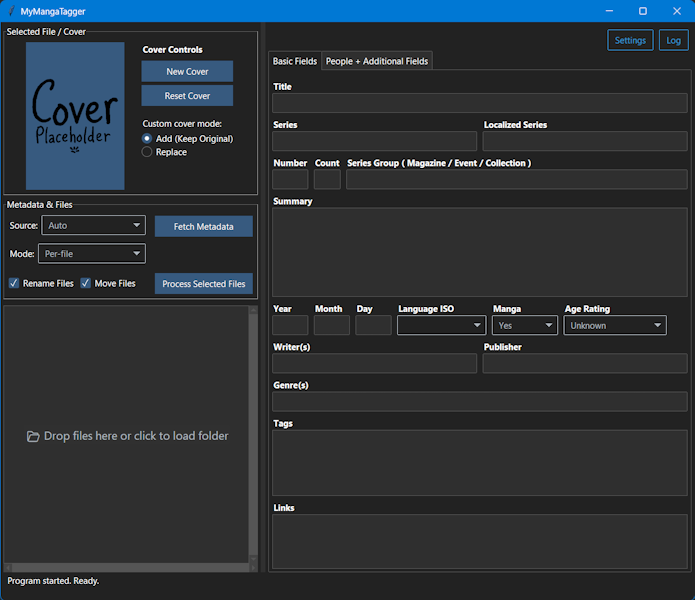
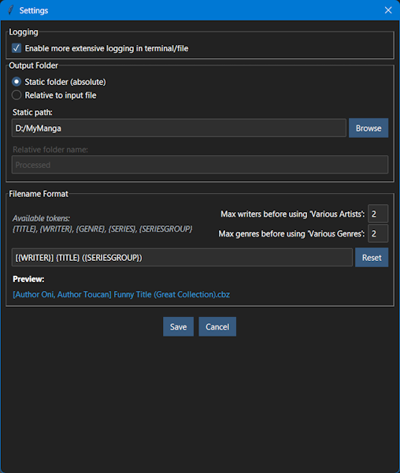

# MyMangaTagger

[](images/gui-preview.png)

**MyMangaTagger** is a desktop tool for managing metadata in `.cbz` files, with support for fetching information from [Anilist](https://anilist.co) (more can and will likely be added). It is heavily inspired by [MangaManager](https://github.com/MangaManagerORG/Manga-Manager) and is purely a learning and experimentation project for me, with heavy use of AI assistance.

The app provides a drag-and-drop GUI that allows you to load manga, fetch metadata, edit fields, and save the results directly inside each archive via `ComicInfo.xml`.

---

## ✨ Features

- Load `.cbz` or `.zip` files from folder or via drag-and-drop
- Fetch metadata from:
  - `Anilist.co` (GraphQL API with JSON response)
- Edit metadata in a user-friendly GUI
- Add new cover image (will add selected file as `00000!__cover.{ext}` to archive when processed)
- Fully customizable filename format using tokens like `{TITLE}`, `{IMPRINT_WRITER}`, etc.
  - Set the pattern via the settings dialog
  - Live preview and "Reset" button included
- After editing, rename and organize files during processing
  - If moving of files is enabled, processed files are placed in the configured output folder. By default it uses `\Processed\...` relative to the source location of the file. A fixed and absolute path can also be configured.
    - Files with a `Series` value will be placed in `\OUTPUT_FOLDER\<SERIES_NAME>\...`
- Save metadata as `ComicInfo.xml` inside archive

---

## 📦 Requirements

- Python 3.12 or newer
- Install dependencies:

```bash
pip install -r requirements.txt
```

---

## 🚀 How to Use

Open it through PowerShell with command below or double-click the run.pyw file.
```bash
python run.pyw
```

1. Load or drop `.cbz` or `.zip` files. `.zip` files are automatically renamed to `.cbz`.
2. Select one or more files.
3. Select fetching mode (Per-file / Single URL -> Apply to all).
4. Select source and click the Fetch button.
5. Dialog popup appears showing the filename. When using "Per-file" mode the filename is automatically copied to clipboard for quick search on source site.
6. Paste the URL for the file shown in the dialog. The dialog auto-accepts when a valid link is pasted or dropped.
7. Edit any fields if needed.
8. (Optional) Drop new cover in the cover preview area or click "New Cover".
9. Click **Process Selected Files** to save metadata and rename and/or move files if enabled.

---

## ⚙️ Settings

[](images/settings-preview.png)

Click the **Settings** button in the GUI to configure:

- **Debug logging**  
  Enable verbose logs in console and logfile for troubleshooting purposes. Log Viewer is unaffected.

- **Output folder settings**  
  Controls where processed files are moved when **Move Files** is enabled:

  - **Mode: Static**  
    Saves files to a fixed, absolute path.  
    - Use the **Browse** button to select a destination folder.  

  - **Mode: Relative**  
    Saves files to a subfolder next to the input file.  
    - Default folder name: `Processed`  
    - You can customize this name (e.g. "Tagged", "Done", etc.)

  > Files with a `Series` value will still be placed into subfolders inside the output folder (e.g. `Processed/Frieren/...` or `C:/MyManga/Frieren/...`).

- **Filename format**  
  Customize how files are renamed by defining a filename pattern with tokens.

  - Example:  
    ```
    [{IMPRINT_WRITER}] {TITLE} ({SERIESGROUP}) ({GENRE})
    ```
  - Live preview is shown based on example data
  - Use the **Reset** button to revert to the default template
  - Max writers before using 'Various Artists':  
  Sets how many writer names are allowed in a filename before collapsing them into "Various Artists".
    - A value of `0` disables the limit and includes all writer names.
  - Max genres before using 'Various Genres':  
  Sets how many genre names are allowed in a filename before collapsing them into "Various Genres".
    - A value of `0` disables the limit and includes all genre names.

  **Available tokens:**
    - `{TITLE}`
    - `{WRITER}`
    - `{IMPRINT}`
    - `{IMPRINT_WRITER}` – intelligently combines IMPRINT and WRITER
    - `{GENRE}`
    - `{SERIESGROUP}`
    - `{SERIES}`

Changes are saved to `settings.json` in the app directory. The file is listed in `.gitignore` by default.

---

## 🗂 App Structure

```
MyMangaTagger/
├── run.pyw                    # Entry point to launch the application
├── requirements.txt           # Python dependencies (pip install -r requirements.txt)
├── settings.json              # User configuration and settings
│
├── assets/                    
│   └── default_cover.png      # Default cover image as placeholder
│
├── gui/                       # All GUI components and dialogs
│   ├── log_viewer.py          # Log viewer window for displaying application logs
│   ├── main_window.py         # Main GUI application window and event loop
│   ├── settings_dialog.py     # Dialog window for editing app/user settings
│   ├── url_dialog.py          # Dialog window for entering URLs for metadata fetching
│   ├── utils.py               # Utility functions for GUI dialogs and windows
│   │
│   └── panels/                # Modular UI panels for main layout
│       ├── control_panel.py   # Buttons and controls for processing
│       ├── cover_panel.py     # Cover preview and drop-zone
│       └── file_list_panel.py # Scrollable UI panel listing loaded files
│
├── services/                  # Core logic and reusable backend utilities
│   ├── config.py              # Handles loading and updating user config/settings
│   ├── constants.py           # Global constants (default values, settings)
│   ├── cover_manager.py       # Logic for extracting and replacing cover images
│   ├── file_io.py             # All file I/O for CBZ/ZIP, metadata, etc.
│   ├── logger.py              # Logging setup, formatting, and GUI integration
│   ├── normalization.py       # String normalization, cleanup, casing rules
│   └── templating.py          # Filename generation and template logic
│
└── sources/                   # Source adapter implementations for extensibility
    ├── base.py                # Abstract base class/interface for metadata sources
    ├── loader.py              # Auto-import for drop-in source discovery
    ├── router.py              # URL-routing to the correct concrete source
    └── anilist.py             # Adapter for integrating Anilist as a metadata source
```

---

## 📄 License

This project is open source. Do what you want with it. You are responsible for complying with the terms of service of any source you use.
